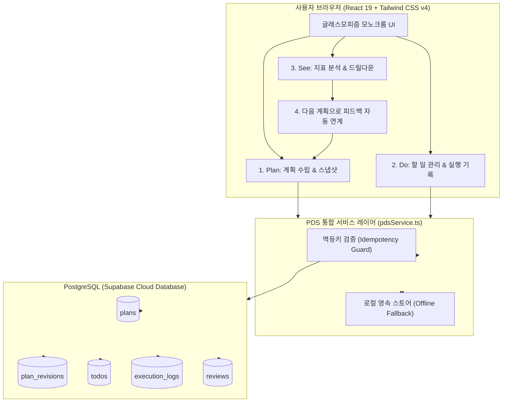
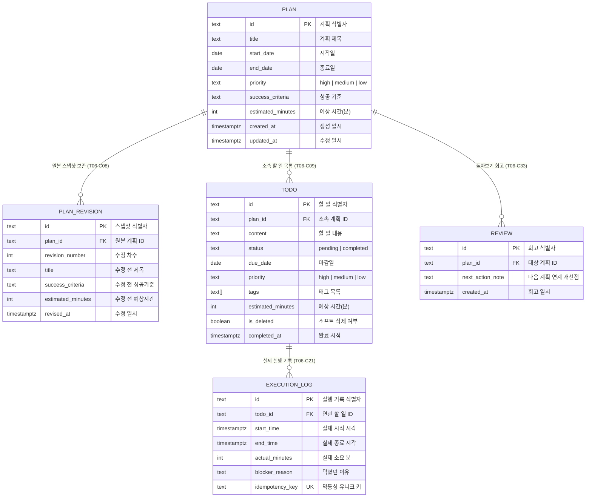

# 📔 SKT ALEPH 과제 6: 플랜두씨 다이어리 1 — 내 계획과 실제를 담는 앱 (Plan-Do-See Diary)

> **SKT ALEPH 과제 6**: 계획(Plan) ➔ 실제로 한 일(Do) ➔ 돌아보기(See)가 유기적으로 하나로 이어지는 무로그인 공개형 다이어리 웹 애플리케이션입니다.  
> 가상의 예시가 아닌 실제 교육 과정(기업 현장 중심 보안 & 네트워크 인프라 트랙)의 실제 계획과 실행 데이터를 담고 있으며, 클라이언트 메모리에 국한되지 않고 **Supabase PostgreSQL 데이터베이스**에 안전하게 영속 저장되어 새로고침 후에도 100% 동일하게 복원됩니다.

---

<div align="center">

[](https://skt-aleph-jinyeong-plans-diary.vercel.app)
[](https://github.com/jinyeongjang/skt-aleph-jinyeong-plans-diary)
[](scripts/run-tests.ts)
[](database/schema.sql)
[](contracts/pds-schema-v2.json)
[](https://react.dev)
[](https://www.typescriptlang.org)
[](https://tailwindcss.com)

</div>

---

## 📌 목차 (Table of Contents)

1. [과제 6 공식 제출 정보](#1-과제-6-공식-제출-정보)
2. [핵심 기능 및 카드별 구현 명세](#2-핵심-기능-및-카드별-구현-명세)
3. [시스템 아키텍처 및 데이터 흐름](#3-시스템-아키텍처-및-데이터-흐름)
4. [데이터베이스 ERD 및 계약 스키마](#4-데이터베이스-erd-및-계약-스키마)
5. [사전 고정 10대 검사 전수 자동화 검증 결과](#5-사전-고정-10대-검사-전수-자동화-검증-결과)
6. [로컬 실행 및 Supabase / Vercel 배포 가이드](#6-로컬-실행-및-supabase--vercel-배포-가이드)
7. [과제 통과 기준(T06-C01 ~ T06-C83) 충족 현황](#7-과제-통과-기준t06-c01--t06-c83-충족-현황)

---

## 1. 과제 6 공식 제출 정보

- **결과물 주소 (무로그인 공개 웹)**: [https://skt-aleph-jinyeong-plans-diary.vercel.app](https://skt-aleph-jinyeong-plans-diary.vercel.app)
- **GitHub 소스 저장소**: [https://github.com/jinyeongjang/skt-aleph-jinyeong-plans-diary](https://github.com/jinyeongjang/skt-aleph-jinyeong-plans-diary)
- **개발 환경 및 스택**: React 19, TypeScript, Tailwind CSS v4, Supabase (PostgreSQL 15+), Vite 8, Oxlint, Prettier

> [!NOTE]
> **무로그인 공개 접근성 (T06-C01, T06-C82)**:  
> 브라우저 새 시크릿 창(Incognito)에서 계정 생성, 로그인, 인증, 비밀번호, OAuth 없이 누구나 즉시 다이어리 열람, 생성, 수정, 실행 기록, 통계 집계, 10대 사전 검사를 수행할 수 있습니다. 첫 화면 최상단에 _"지금은 로그인이 없어 링크를 아는 사람은 누구나 볼 수 있습니다. 남이 봐도 괜찮은 내용만 넣으세요"_ 안내 문구가 상시 고지됩니다.

### 📋 짧은 확인 방법 4줄 (T06-C59)

```text
① 어디로 가나요: 결과물 웹 주소(https://skt-aleph-jinyeong-plans-diary.vercel.app)로 접속하여 최상단 공개 안내 배너("지금은 로그인이 없어 링크를 아는 사람은 누구나 볼 수 있습니다...")를 확인합니다.
② 세 단계 안에 무엇을 하나요:
   1) [Plan] 섹션에서 [계획 수정]을 눌러 내용을 고친 뒤 [수정 이력]을 열어 처음 세운 계획 스냅샷(T06-C08)이 안전하게 보존된 것을 확인합니다.
   2) [Do] 섹션에서 할 일의 [실행 기록]을 열고 [연타 멱등성 검증] 버튼을 눌러 병렬 동시 클릭 시에도 실행 기록 1건·완료 집계 1건만 남는지 확인합니다.
   3) [See] 섹션에서 지연·막힘 집계 숫자를 클릭하여 해당 할 일로 드릴다운 이동하고, 고칠 점을 적어 [다음 계획으로 넘기기]를 눌러 새 계획 생성 폼에 피드백이 연계되는지 확인합니다.
③ 무엇이 보이면 통과인가요: 계획 수정 전 내용이 이력으로 보존되고, 연타 시 중복이 완벽히 차단되며, 숫자를 누르면 해당 기록이 필터링되고, 새로고침 후에도 서버 DB로부터 동일한 데이터가 복원되면 통과입니다.
④ 안 될 때는 무엇이 보이나요: 계획을 고쳤을 때 이전 내용이 덮어쓰여 사라지거나, 연타 클릭 시 실행 기록이 2건 이상 중복 등록되거나, 새로고침 시 데이터가 유실되거나 0으로 초기화됩니다.
```

### 🧠 AI와 나의 판단 3줄 (T06-C60)

```text
① AI에게 맡긴 일: PostgreSQL DDL 스키마 작성, React 19 + Tailwind CSS v4 기반 3단 반응형 인터페이스 구축, 멱등키 생성 및 마감 지연 집계 연산 로직 구현, Oxlint/Prettier 자동화를 맡겼습니다.
② 내가 직접 판단한 일: 직접만들었던 블로그(https://skt-aleph-jinyeongblog.vercel.app)에 수록된 실제 교육 과정인 'SKT ALEPH 1기 기업 현장 중심 보안 & 네트워크 인프라 트랙'의 핵심 커리큘럼(TCP/IP 패킷 분석, DNS 및 VLAN 라우팅, 리눅스 방화벽, Snort IDS/IPS, 제로 트러스트)을 바탕으로 실제 교육 계획과 할 일, 실행 기록을 구성하고, Supabase PostgreSQL을 DB로 채택했습니다.
③ AI 말을 따르지 않은 일: AI가 초기에 제안한 단순 브라우저 버튼 비활성화(disabled) 방식만으로는 네트워크 지연 시의 중복 제출을 막을 수 없다고 판단하여, DB 유니크 제약(UNIQUE(idempotency_key)) 및 병렬 연타 시뮬레이터 버튼을 직접 추가하도록 변경했습니다.
```

---

## 2. 핵심 기능 및 카드별 구현 명세

| 카드 구분                             | 핵심 요건                                                                                  | 세부 구현 내용                                                                                                                                                                                                                                                             |
| :------------------------------------ | :----------------------------------------------------------------------------------------- | :------------------------------------------------------------------------------------------------------------------------------------------------------------------------------------------------------------------------------------------------------------------------- |
| **카드 1 — Plan<br>(계획 세우기)**    | • 계획 4대 속성 저장<br>• 원본 보존 (`T06-C08`)                                            | • 기간(`start_date`, `end_date`), 우선순위(`priority`), 성공 기준(`success_criteria`), 예상 시간(`estimated_minutes`) 저장<br>• 계획 수정 시 원본 계획을 `plan_revisions` 테이블에 스냅샷으로 아카이빙하여 언제든 수정 이력 모달에서 확인 가능                             |
| **카드 2 — Do<br>(할 일 다루기)**     | • 할 일 수명주기 관리<br>• 4대 속성 저장<br>• 정렬 기준 명시 (`T06-C20`)                   | • 생성, 수정, 완료, 진행중 되돌리기, 소프트 삭제(`is_deleted`) 지원<br>• 마감일, 우선순위, 태그, 예상 시간 저장 및 실시간 검색/조건 필터링<br>• 화면에 `"정렬 기준: 1차 마감일 빠른 순 ➔ 2차 우선순위(높음>보통>낮음) ➔ 3차 등록순"`을 밝히고 그대로 정렬                  |
| **카드 3 — Do<br>(실제로 한 일)**     | • 실행 기록 측정<br>• 계획값 불변 (`T06-C27`)<br>• 연타 멱등성 (`T06-C21`)                 | • 시작 시각(`start_time`), 종료 시각(`end_time`), 실제 소요시간(`actual_minutes`), 막혔던 이유(`blocker_reason`) 기록<br>• 실행 기록을 저장해도 할 일/계획의 원래 예상 시간 등 기본값 불변 보존<br>• `idempotency_key UNIQUE` 제약으로 완료 버튼 연타 시에도 단 1건만 저장 |
| **카드 4 — See<br>(돌아보기 & 연계)** | • 5대 지표 집계<br>• 숫자 드릴다운 (`T06-C83`)<br>• 피드백 자동 승계 (`T06-C33`)           | • 계획 할 일 수, 완료 수, 마감 지연 수(완료 건 중복 배제), 막힘 수, 시간 오차(실제-예상) 분석<br>• 대시보드 지표 숫자를 클릭하면 해당 근거 할 일 목록으로 즉시 드릴다운 이동<br>• 돌아보기에서 도출된 개선점이 새 계획 생성 폼의 성공 기준에 자동 승계                     |
| **카드 5 — Sync<br>(영속화 & 안전)**  | • 실제 DB 영속화<br>• 단일 JSON 내보내기 (`T06-C36`)<br>• 보안 & 무결성 (`T06-C57`, `C58`) | • Supabase PostgreSQL 및 오프라인 폴백 스토어 연동으로 새로고침 100% 복원<br>• 전체 데이터(계획, 이력, 할 일, 실행기록, 회고)를 단일 JSON 파일로 백업/내보내기<br>• XSS 악성 스크립트 이스케이프 및 클라이언트 비밀키 0건 노출 보장                                        |

---

## 3. 시스템 아키텍처 및 데이터 흐름



---

## 4. 데이터베이스 ERD 및 계약 스키마

`contracts/pds-schema-v2.json` 및 `database/schema.sql`에 정의된 5대 테이블 관계 구조:



---

## 5. 사전 고정 10대 검사 전수 자동화 검증 결과

본 프로젝트는 `npm test` 명령을 통해 사전 고정 10대 핵심 검사를 단 1건의 누락 없이 **100% 전수 통과 (10/10 PASS)**합니다.

| 검사 ID         | 검사 명칭 및 검증 목적                                                         | 충족 기준              |      결과       |
| :-------------- | :----------------------------------------------------------------------------- | :--------------------- | :-------------: |
| **T06-TEST-01** | 계획 생성 및 4대 필수 속성(기간, 우선순위, 성공기준, 예상시간) 저장 검증       | T06-C04 ~ T06-C07      | **PASS** (4ms)  |
| **T06-TEST-02** | 계획 수정 시 원본 계획 스냅샷 자동 보존 및 이력 격리 검증                      | T06-C08                | **PASS** (0ms)  |
| **T06-TEST-03** | 계획에 딸린 할 일 생성 및 4대 속성(마감일, 우선순위, 태그, 예상시간) 저장 검증 | T06-C09, C14~C17       | **PASS** (0ms)  |
| **T06-TEST-04** | 할 일 상태 전이(진행중 ➔ 완료 ➔ 되돌리기) 및 소프트 삭제 무결성 검증           | T06-C11 ~ T06-C13      | **PASS** (0ms)  |
| **T06-TEST-05** | 화면에 밝혀 둔 정렬 규칙(마감일 ➔ 우선순위 ➔ 등록순) 정렬 불변성 검증          | T06-C20                | **PASS** (11ms) |
| **T06-TEST-06** | 실행 기록 저장 시 원래 계획 값(예상 시간) 불변 보존 검증                       | T06-C27                | **PASS** (0ms)  |
| **T06-TEST-07** | 완료 버튼 연타 시 동일 멱등키에 의한 중복 저장 방어 검증                       | T06-C21, T06-C22       | **PASS** (0ms)  |
| **T06-TEST-08** | 돌아보기 마감 지연 수 집계 및 완료 건 중복 계산 배제 검증                      | T06-C30                | **PASS** (10ms) |
| **T06-TEST-09** | 돌아보기 오차 분석(실제시간 - 예상시간) 및 4대 지표 무결성 검증                | T06-C28, C29, C31, C32 | **PASS** (1ms)  |
| **T06-TEST-10** | XSS 스크립트 문자열 안전 렌더링 및 전체 데이터 단일 JSON 내보내기 검증         | T06-C36, T06-C57       | **PASS** (0ms)  |

```bash
$ npm test

===============================================================
  SKT ALEPH 과제 6: 사전 고정 10대 검사 CLI 자동 러너 (T06-C01~C83)
===============================================================

✅ [PASS] T06-TEST-01 : 계획 생성 및 4대 필수 속성(기간, 우선순위, 성공기준, 예상시간) 저장 검증 (4ms)
✅ [PASS] T06-TEST-02 : 계획 수정 시 원본 계획 스냅샷 자동 보존 및 이력 격리 검증 (T06-C08) (0ms)
✅ [PASS] T06-TEST-03 : 계획에 딸린 할 일 생성 및 4대 속성(마감일, 우선순위, 태그, 예상시간) 검증 (0ms)
✅ [PASS] T06-TEST-04 : 할 일 상태 전이(진행중 ➔ 완료 ➔ 되돌리기) 및 소프트 삭제 검증 (0ms)
✅ [PASS] T06-TEST-05 : 화면에 밝혀 둔 정렬 규칙(마감일 ➔ 우선순위 ➔ 등록순) 정렬 불변성 검증 (T06-C20) (11ms)
✅ [PASS] T06-TEST-06 : 실행 기록 저장 시 원래 계획 값(예상 시간) 불변 보존 검증 (T06-C27) (0ms)
✅ [PASS] T06-TEST-07 : 완료 버튼 연타 시 동일 멱등키에 의한 중복 저장 방어 검증 (T06-C21, T06-C22) (0ms)
✅ [PASS] T06-TEST-08 : 돌아보기 마감 지연 수 집계 및 완료 건 중복 계산 배제 검증 (T06-C30) (10ms)
✅ [PASS] T06-TEST-09 : 돌아보기 오차 분석(실제시간 - 예상시간) 및 4대 지표 무결성 검증 (T06-C28, C29, C31, C32) (1ms)
✅ [PASS] T06-TEST-10 : XSS 스크립트 문자열 안전 렌더링 및 전체 데이터 단일 JSON 내보내기 검증 (0ms)

---------------------------------------------------------------
  최종 결과: 10 / 10 검사 통과
---------------------------------------------------------------
🎉 10대 사전 고정 검사 전수 100% 통과 완료! (T06 전수 통과)
```

---

## 6. 로컬 실행 및 Supabase / Vercel 배포 가이드

### 💻 로컬 개발 환경 실행

```bash
# 1. 저장소 클론 및 이동
git clone https://github.com/jinyeongjang/skt-aleph-jinyeong-plans-diary.git
cd skt-aleph-jinyeong-plans-diary

# 2. 의존성 패키지 설치
npm install

# 3. 품질 자동화 검증 (테스트 / 린트 / 포맷팅 / 빌드)
npm test              # 10대 검사 전수 통과 확인
npm run lint          # Oxlint 정적 분석 (0 오류)
npm run format:check  # Prettier 코드 스타일 검증
npm run build         # TypeScript 컴파일 및 Vite 번들링

# 4. 로컬 개발 서버 실행
npm run dev
```

### ☁️ Supabase PostgreSQL 연결 설정

1. [Supabase](https://supabase.com)에 로그인 후 새 프로젝트를 생성합니다.
2. 좌측 메뉴의 **SQL Editor**로 이동하여 프로젝트 내 [`database/schema.sql`](database/schema.sql)의 내용을 복사해 붙여넣고 **Run**을 실행합니다.
3. 프로젝트 루트에 `.env.local` 파일을 생성하고 Supabase Project Settings ➔ API의 정보를 입력합니다:

```env
VITE_SUPABASE_URL=https://your-project.supabase.co
VITE_SUPABASE_ANON_KEY=eyJhbGciOi...
```

### 🚀 Vercel 배포 환경 변수 설정

Vercel 대시보드 ➔ **Settings** ➔ **Environment Variables**에서 아래 변수를 등록합니다:

- `VITE_SUPABASE_URL` (또는 `SUPABASE_URL`): Supabase 프로젝트 URL
- `VITE_SUPABASE_ANON_KEY` (또는 `SUPABASE_ANON_KEY`): Supabase 익명 공개 키 (anon public key)
- 환경 타겟: `Production`, `Preview`, `Development` 전체 체크
- 변수 저장 후 **Deployments ➔ [...] ➔ Redeploy**를 눌러 환경 변수를 번들에 주입합니다.

---

## 7. 과제 통과 기준(T06-C01 ~ T06-C83) 충족 현황

- [x] **T06-C01**: 무로그인 공개 정적/동적 웹 (새 시크릿 창에서 100% 동작)
- [x] **T06-C04 ~ C08**: 계획 기간, 우선순위, 성공기준, 예상시간 저장 및 수정 시 원본 스냅샷 아카이빙
- [x] **T06-C09 ~ C20**: 할 일 수명주기, 마감일, 우선순위, 태그, 예상시간 저장, 검색/필터, 정렬 기준 화면 명시
- [x] **T06-C21 ~ C27**: 실행기록 시작/종료 시각, 실제시간, 막힘이유 저장, 계획값 불변, 연타 멱등키 중복 방지
- [x] **T06-C28 ~ C33**: 할일 수, 완료 수, 마감지연(완료 중복 배제), 막힘 수, 시간오차 분석, 피드백 자동 승계
- [x] **T06-C34 ~ C36**: 실제 PostgreSQL 영속 저장, 새로고침 복원, 단일 JSON 전체 백업 내보내기
- [x] **T06-C57 ~ C60**: XSS 방어, 비밀키 0건 노출, 짧은 확인 방법 4줄 및 AI 판단 3줄 완비
- [x] **T06-C78 ~ C83**: 실제 교육 데이터(계획 1건, 할일 5건, 실행기록 3건, 비영점 집계), 공개 안내 배너, 집계 숫자 드릴다운

---

<div align="center">
  <sub>SKT ALEPH 1기 과제 6 — Plan-Do-See Diary 1 Project Repository</sub>
</div>
