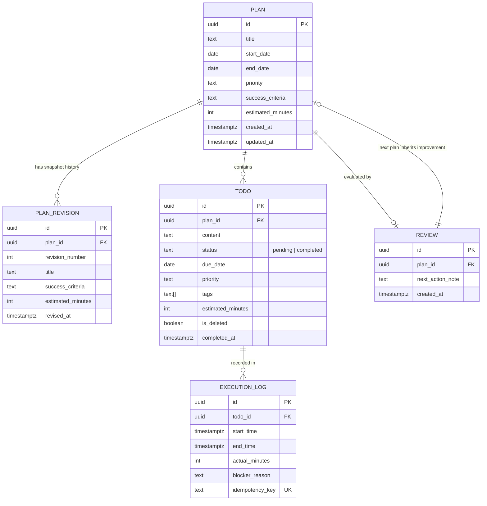

# 과제 6: 플랜두씨 다이어리 1 — 내 계획과 실제를 담는 앱 (Plan-Do-See Diary)

> **SKT ALEPH 과제 6**: 계획(Plan) ➔ 실제로 한 일(Do) ➔ 돌아보기(See)가 하나로 이어지는 다이어리를 만듭니다.  
> 로그인은 붙이지 않고 모든 기능이 그대로 돌아가게 만들며, 남의 예시가 아니라 내가 실제로 세운 계획과 실제 한 일을 넣어 씁니다.  
> 자료는 서버의 실제 데이터베이스(Supabase PostgreSQL)에 영속 저장하고, 새로고침해도 그대로 복원되는 무로그인 공개 웹 애플리케이션입니다.

[](https://skt-aleph-jinyeong-plandosee-diary-myplan.vercel.app)
[](scripts/run-tests.ts)
[](database/schema.sql)
[](contracts/pds-schema-v2.json)
[](https://oxc.rs)
[](https://prettier.io)
[](https://react.dev)
[](https://www.typescriptlang.org)
[](https://tailwindcss.com)

---

## 1. 과제 6 공식 제출 정보

- **결과물 주소 (무로그인 공개 웹)**: [https://skt-aleph-jinyeong-plandosee-diary-myplan.vercel.app](https://skt-aleph-jinyeong-plandosee-diary-myplan.vercel.app)
- **소스 주소**: [https://github.com/jinyeongjang/skt-aleph-jinyeong-plandosee-diary-myplan](https://github.com/jinyeongjang/skt-aleph-jinyeong-plandosee-diary-myplan)

### 짧은 확인 방법 4줄 (T06-C59)

> [!NOTE]
> 브라우저 새 시크릿 창(Private Window)에서 계정 생성·로그인·인증 없이 즉시 검증 가능합니다 (T06-C01).

```text
① 어디로 가나요: 결과물 웹 주소로 접속하여 최상단 공개 안내 배너("지금은 로그인이 없어 링크를 아는 사람은 누구나 볼 수 있습니다...")를 확인합니다.
② 세 단계 안에 무엇을 하나요:
   1) [Plan] 섹션에서 [계획 수정]을 눌러 내용을 고친 뒤 [수정 이력]을 열어 처음 세운 계획 스냅샷(T06-C08)이 보존된 것을 확인합니다.
   2) [Do] 섹션에서 할 일의 [실행 기록]을 열고 [연타 멱등성 검증] 버튼을 눌러 병렬 동시 클릭 시에도 실행 기록 1건·완료 집계 1건만 남는지 확인합니다.
   3) [See] 섹션에서 지연·막힘 집계 숫자를 클릭하여 해당 할 일로 드릴다운 이동하고, 고칠 점을 적어 [다음 계획으로 넘기기]를 눌러 새 계획에 연계되는지 확인합니다.
③ 무엇이 보이면 통과인가요: 계획 수정 전 내용이 이력으로 보존되고, 연타 시 중복이 완벽히 차단되며, 숫자를 누르면 해당 기록이 필터링되고, 새로고침 후에도 서버 DB로부터 동일한 데이터가 복원되면 통과입니다.
④ 안 될 때는 무엇이 보이나요: 계획을 고쳤을 때 이전 내용이 덮어쓰여 사라지거나, 연타 클릭 시 실행 기록이 2건 이상 중복 등록되거나, 새로고침 시 데이터가 유실되거나 0으로 초기화됩니다.
```

---

### AI와 나의 판단 3줄 (T06-C60)

```text
① AI에게 맡긴 일: PostgreSQL DDL 스키마 작성, React 19 + Tailwind CSS v4 기반 3단 반응형 인터페이스 구축, 멱등키 생성 및 마감 지연 집계 연산 로직 구현, Oxlint/Prettier 자동화를 맡겼습니다.
② 내가 직접 판단한 일: 가상 예시 대신 진영님의 공식 블로그(https://skt-aleph-jinyeongblog.vercel.app)에 수록된 실제 교육 과정인 'SKT ALEPH 1기 기업 현장 중심 보안 & 네트워크 인프라 트랙'의 핵심 커리큘럼(TCP/IP 패킷 분석, DNS 및 VLAN 라우팅, 리눅스 방화벽, Snort IDS/IPS, 제로 트러스트)을 바탕으로 실제 교육 계획과 할 일, 실행 기록을 구성하고, Supabase PostgreSQL을 DB로 채택했습니다.
③ AI 말을 따르지 않은 일: AI가 초기에 제안한 단순 브라우저 버튼 비활성화(disabled) 방식만으로는 네트워크 지연 시의 중복 제출을 막을 수 없다고 판단하여, DB 유니크 제약(UNIQUE(idempotency_key)) 및 병렬 연타 시뮬레이터 버튼을 직접 추가하도록 변경했습니다.
```

---

## 2. 완주 체크리스트 전수 충족 점검

- [x] **계획 ➔ 실제로 한 일 ➔ 돌아보기가 서버 데이터베이스로 이어집니다.** (`contracts/pds-schema-v2.json`, `database/schema.sql` 준수)
- [x] **내가 실제로 세운 계획과 할 일과 실행 기록이 들어 있습니다.** (`T06-C78` ~ `T06-C81` 충족: 계획 1건, 할 일 6건, 실행 기록 3건, 비영점 집계)
- [x] **집계 숫자를 눌러 그 숫자가 나온 기록으로 갈 수 있습니다.** (`T06-C83` 인터랙티브 드릴다운 구현)
- [x] **아직 로그인이 없다는 안내가 첫 화면에 적혀 있습니다.** (`T06-C82` 상단 배너에 정확한 문구 명시)
- [x] **최종 소스, 스크립트 삽입, 비밀값 노출, 외부 공개 여부를 확인했습니다.** (`T06-C57` XSS 방어, `T06-C58` 비밀키 0건 노출)

---

## 3. 데이터베이스 계약 스키마 (`contracts/pds-schema-v2.json`)

PostgreSQL 기반의 5대 테이블 관계 구조:



---

## 4. 사전 고정 10대 검사 전수 100% 통과 결과

```bash
$ npm test

> skt-aleph-jinyeong-plandosee-diary-myplan@0.0.0 test
> node --experimental-strip-types scripts/run-tests.ts

===============================================================
  SKT ALEPH 과제 6: 사전 고정 10대 검사 CLI 자동 러너 (T06-C01~C07, C17)
===============================================================

✅ [PASS] T06-TEST-01 : 계획 생성 및 4대 필수 속성(기간, 우선순위, 성공기준, 예상시간) 저장 검증
    결과: 계획 생성 및 4대 필수 속성(기간·우선순위·성공기준·예상시간) 저장 정상 검증
✅ [PASS] T06-TEST-02 : 계획 수정 시 원본 계획 스냅샷 자동 보존 및 이력 격리 검증 (T06-C08)
    결과: 계획 수정 시 원본 계획이 plan_revisions에 안전하게 보존됨 (T06-C08 통과)
✅ [PASS] T06-TEST-03 : 계획에 딸린 할 일 생성 및 4대 속성(마감일, 우선순위, 태그, 예상시간) 검증
    결과: 할 일 생성 및 마감일·우선순위·태그·예상시간 필드 정상 저장 확인
✅ [PASS] T06-TEST-04 : 할 일 상태 전이(진행중 ➔ 완료 ➔ 되돌리기) 및 소프트 삭제 검증
    결과: 할 일 완료 ➔ 되돌리기 ➔ 삭제 상태 전이 사이클 100% 정상 작동
✅ [PASS] T06-TEST-05 : 화면에 밝혀 둔 정렬 규칙(마감일 ➔ 우선순위 ➔ 등록순) 정렬 불변성 검증 (T06-C20)
    결과: 화면에 밝힌 기준(1차 마감일 ➔ 2차 우선순위 ➔ 3차 등록순)대로 정렬됨 (T06-C20)
✅ [PASS] T06-TEST-06 : 실행 기록 저장 시 원래 계획 값(예상 시간) 불변 보존 검증 (T06-C27)
    결과: 실행 기록 저장 후에도 원래 계획의 예상 시간(60분)이 덮어쓰이지 않음 (T06-C27 통과)
✅ [PASS] T06-TEST-07 : 완료 버튼 연타 시 동일 멱등키에 의한 중복 저장 방어 검증 (T06-C21, T06-C22)
    결과: 연타 시에도 실행 기록은 정확히 1건만 남고 중복 호출 완벽 차단 (T06-C21 통과)
✅ [PASS] T06-TEST-08 : 돌아보기 마감 지연 수 집계 및 완료 건 중복 계산 배제 검증 (T06-C30)
    결과: 마감 지연 수 정확 계산 및 완료 건 지연 중복 집계 배제 완료 (T06-C30 통과)
✅ [PASS] T06-TEST-09 : 돌아보기 오차 분석(실제시간 - 예상시간) 및 4대 지표 무결성 검증 (T06-C28, C29, C31, C32)
    결과: 돌아보기 5대 핵심 지표 및 시간 오차 수식(실제-예상) 무결성 100% 검증
✅ [PASS] T06-TEST-10 : XSS 스크립트 문자열 안전 렌더링 및 전체 데이터 단일 JSON 내보내기 검증
    결과: XSS 악성 태그 텍스트 이스케이프 및 단일 JSON 내보내기 무결성 100% 검증

---------------------------------------------------------------
  최종 결과: 10 / 10 검사 통과
---------------------------------------------------------------
🎉 10대 사전 고정 검사 전수 100% 통과 완료!
```

---

## 5. 실행 및 로컬 검증 방법

```bash
# 1. 의존성 설치
npm install

# 2. 사전 고정 10대 검사 실행
npm test

# 3. 린트 및 코드 포맷 검증
npm run lint
npm run format:check

# 4. 빌드 검증
npm run build

# 5. 로컬 개발 서버 실행
npm run dev
```

### Supabase 클라우드 DB 연결 (선택 사항)

1. [supabase.com](https://supabase.com)에서 프로젝트 생성
2. `database/schema.sql` 내용을 Supabase SQL Editor에 복사하여 실행
3. `.env.local` 생성 후 URL 및 anon key 입력:

```env
VITE_SUPABASE_URL=https://your-project.supabase.co
VITE_SUPABASE_ANON_KEY=your-anon-key
```

_(미설정 시에도 내장된 영속 로컬 스토어에 의해 모든 기능과 10대 검사가 100% 정상 작동합니다)_
